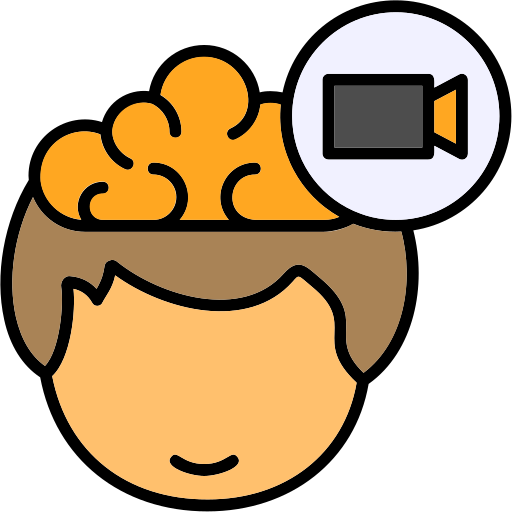

<div align="center">
  <div style="display: flex; align-items: center; justify-content: center; margin-bottom: 15px;">
    
    <h2 style="border-bottom: none; margin: 0;">SemVideo: Reconstructs What You Watch from Brain Activity via Hierarchical Semantic Guidance</h2>
  </div>


<!-- [](https://arxiv.org/pdf/2511.04460) -->
[](https://huggingface.co/datasets/YanmHa/SemVideo)
[](https://opensource.org/licenses/MIT)
[](https://www.python.org/downloads/release/python-3100/)

</div>

---


## 📣 Latest News
- **[Feb 22, 2026]**: We have officially open-sourced the pipeline, including code for training, inference, and evaluation. Additionally, we are releasing the CC2017-SE.
- **[Feb 21, 2026]**: 📄 Our paper is now accepted by CVPR 2026.


---


## 📑 Contents

> [!NOTE]
> Quick navigation guide for exploring **SemVideo**

- [💡 Overview](#-overview)
- [🚀 Quick Start](#-quick-start)
- [🏆 Experiments Results](#-experiments-results)
- [📄 Citation](#-citation)
- [🤝 Acknowledge](#-acknowledge)
- [📞 Contact](#-contact)


---


## 💡 Overview


**SemVideo** is a state-of-the-art fMRI-to-video reconstruction framework that decodes dynamic visual experiences from brain activity using **Hierarchical Semantic Guidance**. Unlike previous methods that often suffer from object appearance mismatches or poor motion coherence, SemVideo aligns brain signals with multi-level semantic cues to ensure both visual and temporal fidelity.
  <div align="center">
    
  </div>

### 📂 Datasets


<div align="center">

| Dataset | Description | Download |
|---------|-------------|----------|
| **CC2017-SE**    | Hierarchical Semantic Guidance. |  [🤗 HuggingFace](https://huggingface.co/datasets/YanmHa/SemVideo) |


</div>


---

## 🚀 Quick Start


### Installation

We recommend using different virtual environments for SemVideo training (MAD, SAD) and the pre-trained T2V diffusion model to avoid any conflict between environment package versions.

#### For SemVideo:

To set up the environment for SemVideo, run:
```bash
conda create -n SAD python=3.10
conda activate SAD
# Install dependencies from requirements.txt
pip install -r requirements_SAD.txt
# Install the project in editable mode
pip install -e .
```
```bash
conda create -n MAD python=3.10
conda activate MAD
# Install dependencies from requirements.txt
pip install -r requirements_MAD.txt
# Install the project in editable mode
pip install -e .
```
#### For AnimateDiff
For the installation instructions of AnimateDiff, please follow the official guide.
```bash
conda create -n animatediff python=3.10
conda activate animatediff
cd src/recon/AnimateDiff
pip install -r requirements.txt
```
### Data Preprocessing

We are currently organizing the preprocessed fMRI data and the corresponding processing scripts. We will release the processed datasets and the complete data preprocessing code here shortly. Stay tuned!

### Train SAD
Generate semantic descriptions for different levels (Holi, Anchor, and Motion).
```bash
conda activate SAD
cd src/train/train_cap

for script in main_VIDcap.py main_IMGcap.py main_MONcap.py; do
    python "$script"
done
```
### Train MAD
```bash
conda activate MAD
cd src/train/train_motion

python train_BM.py
```
### Reconstruct anchor-frame

```bash
python src\recon\recon_capimg.py
```

### Reconstruct blurry videos

```bash
python src\recon\recon_blurry.py
```
Transform reconstructed tensors (.pt) into viewable image sequences (.jpg).

See src/recon/Blurry_pt2img.ipynb for the Tensor-to-Image rendering pipeline.

### Reconstruct videos
```bash
conda activate animatediff
cd src\recon\Animatediff
python -m scripts.neuroclips
```
---


## 🏆 Experiments Results

> ### Quantitative Results

  <div align="center">
    
  </div>


> ### Qualitative Results

  <div align="center">
    
  </div>

---

## 📄 Citation

arxiv coming soon.
<!-- ```bibtex
@article{qiao2025v,
  title={V-Thinker: Interactive Thinking with Images},
  author={Qiao, Runqi and Tan, Qiuna and Yang, Minghan and Dong, Guanting and Yang, Peiqing and Lang, Shiqiang and Wan, Enhui and Wang, Xiaowan and Xu, Yida and Yang, Lan and others},
  journal={arXiv preprint arXiv:2511.04460},
  year={2025}
}

``` -->

---

## 🤝 Acknowledge

This inference and part training implementation builds upon [**Neuroclip**](https://github.com/gongzix/NeuroClips), while our eval codes part from Mind-Animator. SemMiner are builds upon [**Qwen2.5-VL**](https://github.com/QwenLM/Qwen2.5-VL). 


---

## 📞 Contact

For any questions or feedback, please reach out to us at yangminghan@bupt.edu.cn
---

## 📄 License

This project is released under the [MIT License](LICENSE).

---

## GitHub Pages Project Page

This repository includes a ready-to-publish project page:

- `index.html`: project page entry.
- `styles.css`: project page styling.
- `assets/`: figures, logo, and the local paper PDF.
- `.github/workflows/pages.yml`: GitHub Actions workflow for Pages deployment.
- `.nojekyll`: keeps GitHub Pages from running Jekyll processing.

To publish:

1. Push this repository to GitHub with `index.html` at the repository root.
2. Open `Settings` -> `Pages`.
3. Under `Build and deployment`, choose `GitHub Actions`.
4. Push to `main` or `master`, or run the `Deploy project page` workflow manually.

After deployment, GitHub will provide a Pages URL in the workflow summary and in `Settings` -> `Pages`.
